# Card: Financeiro
| Visual do Gráfico|
|-----------------------|
| 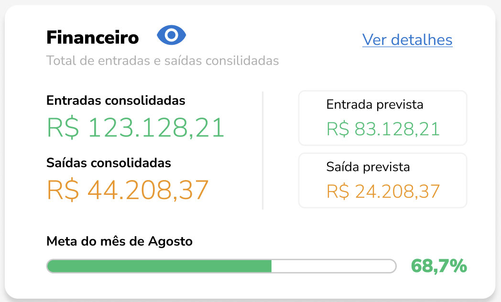 |

```json
{
  "financeiro": {
    "entradasConsolidadas": 123128.21,
    "saidasConsolidadas": 44208.37,
    "entradaPrevista": 83128.21,
    "saidaPrevista": 24208.37,
    "metaMes": {
      "mes": "Agosto",
      "percentualAlcancado": 68.7
    }
  }
}
```

<style>
img[alt="Gráfico de entradas e saídas consolidadas"] {
  max-width: 400px;
  height: auto;
}
</style>
---
# Card: Novos Alunos
| Visual do Gráfico|
|-----------------------|
| 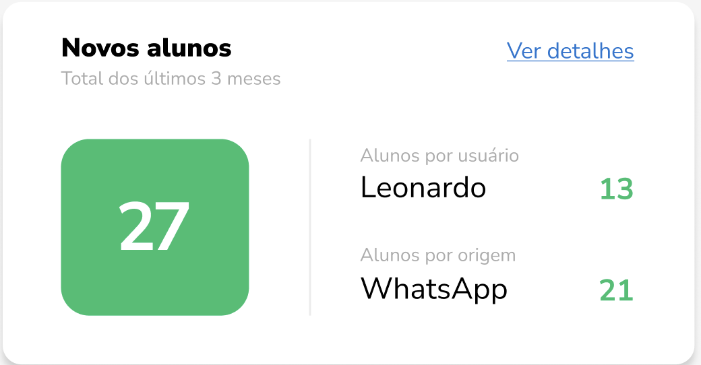 |

```json
{
  "novosAlunos": {
    "total": 27,
    "periodo": "últimos 3 meses",
    "porUsuario": {
      "Leonardo": 13
    },
    "porOrigem": {
      "WhatsApp": 21
    }
  }
}
```

<style>
img[alt="Novos Alunos card"] {
  max-width: 400px;
  height: auto;
}
</style>
---
# Card: Leads
| Visual do Gráfico|
|-----------------------|
| 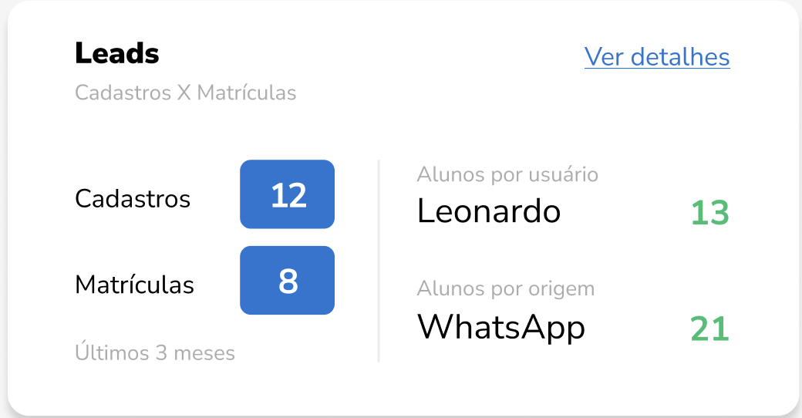 |

```json
{
  "leads": {
    "cadastros": 12,
    "matriculas": 8,
    "periodo": "últimos 3 meses",
    "porUsuario": {
      "Leonardo": 13
    },
    "porOrigem": {
      "WhatsApp": 21
    }
  }
}
```
<style>
img[alt="Gráfico de Leads"] {
  max-width: 400px;
  height: auto;
}
</style>
---
# Card: Aulas práticas
| Visual do Gráfico |
|-------------------|
| 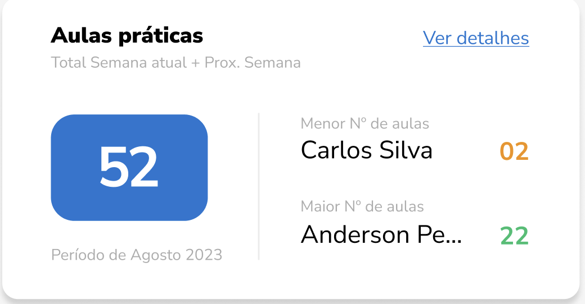 |

```json
{
  "aulasPraticas": {
    "total": 52,
    "periodo": "Agosto 2023",
    "escopo": "Semana atual + próxima semana",
    "menorNumeroAulas": {
      "nome": "Carlos Silva",
      "quantidade": 2
    },
    "maiorNumeroAulas": {
      "nome": "Anderson Pe...",
      "quantidade": 22
    }
  }
}
```
<style>
img[alt="Gráfico de Aulas Práticas"] {
  max-width: 400px;
  height: auto;
}
</style>
---
# Card: Exames
| Visual do Gráfico |
|-------------------|
|  |

```json
{
  "exames": {
    "totalAprovacoes": 47,
    "periodo": "Agosto 2023",
    "veiculoMaisUtilizado": {
      "nome": "Corsa",
      "placa": "PLO 5632",
      "quantidade": 18
    },
    "categoriaMaisAprovada": {
      "nome": "Carro",
      "categoria": "B"
    }
  }
}
```
<style>
img[alt="Gráfico de Exames"] {
  max-width: 400px;
  height: auto;
}
</style>
---
# Card: Entradas e saídas consolidadas (últimos 3 meses)
| Visual do Gráfico |
|-------------------|
| 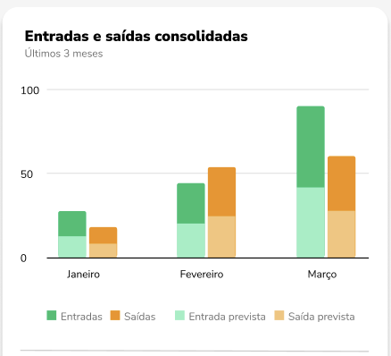 |
Os demais dados deste gráfico já estão disponíveis no card "Financeiro".
```json
{
  "entradasSaidasUltimos3Meses": {
    "entradas": 123128.21,
    "saidas": 44208.37,
    "entradaPrevista": 83128.21,
    "saidaPrevista": 24208.37
  }
}

{
  "financeiroMensal": [
    {
      "mes": "Janeiro",
      "entradas": 30,
      "saidas": 20,
      "entradaPrevista": 20,
      "saidaPrevista": 15
    },
    {
      "mes": "Fevereiro",
      "entradas": 45,
      "saidas": 25,
      "entradaPrevista": 30,
      "saidaPrevista": 25
    },
    {
      "mes": "Março",
      "entradas": 70,
      "saidas": 35,
      "entradaPrevista": 40,
      "saidaPrevista": 30
    }
  ]
}
```
<style>
img[alt="Gráfico de Entradas e Saídas Consolidadas"] {
  max-width: 400px;
  height: auto;
}
</style>
---
# Card: Consolidadas Top 5
| Visual do Gráfico |
|-------------------|
| 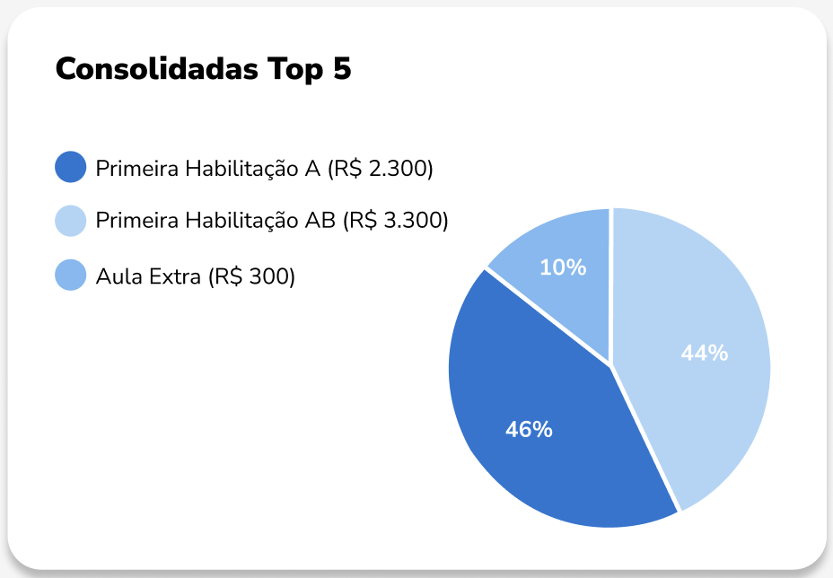 |

```json
{
  "consolidadasTop5": [
    {
      "nome": "Primeira Habilitação A",
      "valor": 2300,
      "percentual": 46
    },
    {
      "nome": "Primeira Habilitação AB",
      "valor": 3300,
      "percentual": 44
    },
    {
      "nome": "Aula Extra",
      "valor": 300,
      "percentual": 10
    }
  ]
}
```
<style>
img[alt="Gráfico de Consolidadas Top 5"] {
  max-width: 400px;
  height: auto;
}
</style>
---
# Card: Novos alunos
| Visual do Gráfico |
|-------------------|
| 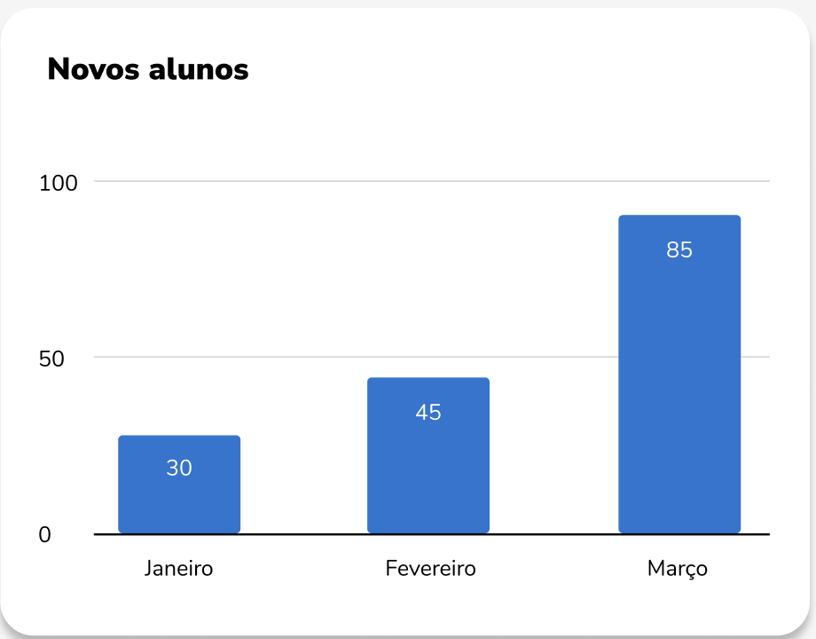 |

```json
{
  "novosAlunosMensal": [
    {
      "mes": "Janeiro",
      "quantidade": 30
    },
    {
      "mes": "Fevereiro",
      "quantidade": 45
    },
    {
      "mes": "Março",
      "quantidade": 85
    }
  ]
}
```
<style>
img[alt="Gráfico de Novos Alunos"] {
  max-width: 400px;
  height: auto;
}
</style>
---
# Card: Alunos por usuário
| Visual do Gráfico |
|-------------------|
| 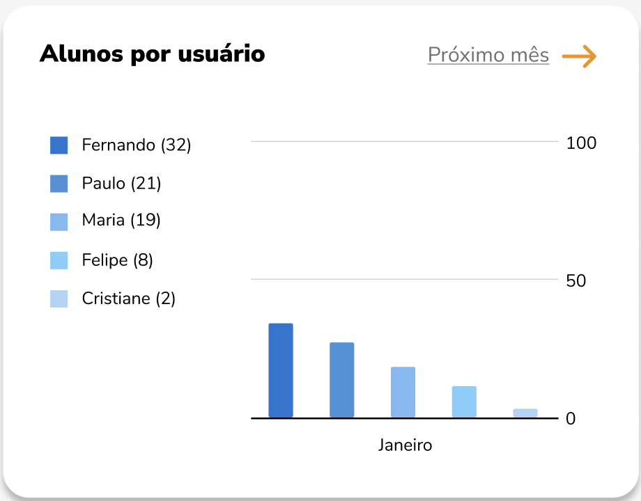 |

```json
{
  "alunosPorUsuario": {
    "mes": "Janeiro",
    "usuarios": [
      {
        "nome": "Fernando",
        "quantidade": 32
      },
      {
        "nome": "Paulo",
        "quantidade": 21
      },
      {
        "nome": "Maria",
        "quantidade": 19
      },
      {
        "nome": "Felipe",
        "quantidade": 8
      },
      {
        "nome": "Cristiane",
        "quantidade": 2
      }
    ]
  }
}
```
<style>
img[alt="Gráfico de Alunos por Usuário"] {
  max-width: 400px;
  height: auto;
}
</style>
---
# Card: Alunos por origem
| Visual do Gráfico |
|-------------------|
| 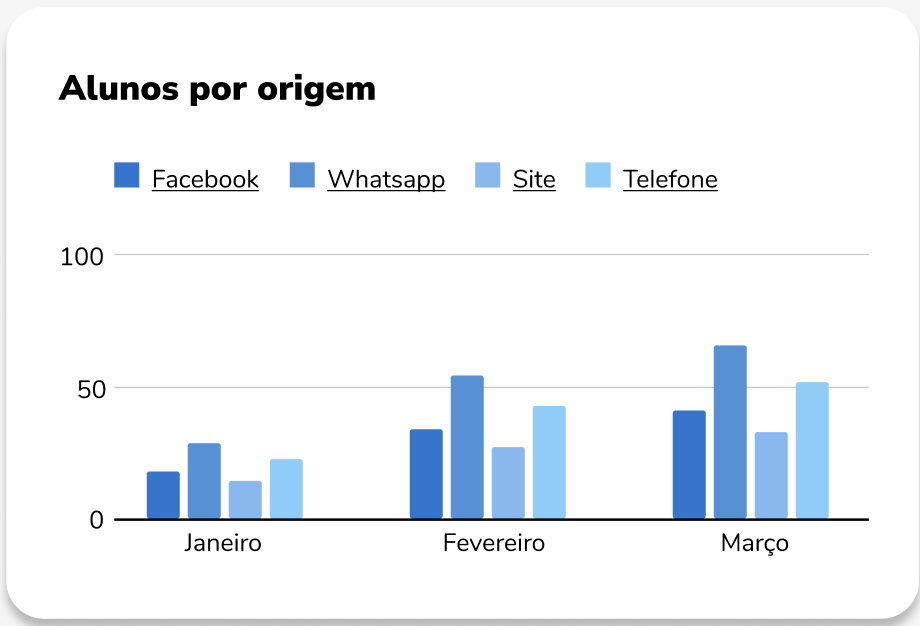 |

```json
{
  "alunosPorOrigem": [
    {
      "mes": "Janeiro",
      "origens": {
        "Facebook": 18,
        "Whatsapp": 28,
        "Site": 15,
        "Telefone": 24
      }
    },
    {
      "mes": "Fevereiro",
      "origens": {
        "Facebook": 34,
        "Whatsapp": 55,
        "Site": 33,
        "Telefone": 43
      }
    },
    {
      "mes": "Março",
      "origens": {
        "Facebook": 42,
        "Whatsapp": 65,
        "Site": 30,
        "Telefone": 52
      }
    }
  ]
}
```
<style>
img[alt="Gráfico de Alunos por Origem"] {
  max-width: 400px;
  height: auto;
}
</style>
---
# Card: Leads por usuário
| Visual do Gráfico |
|-------------------|
| 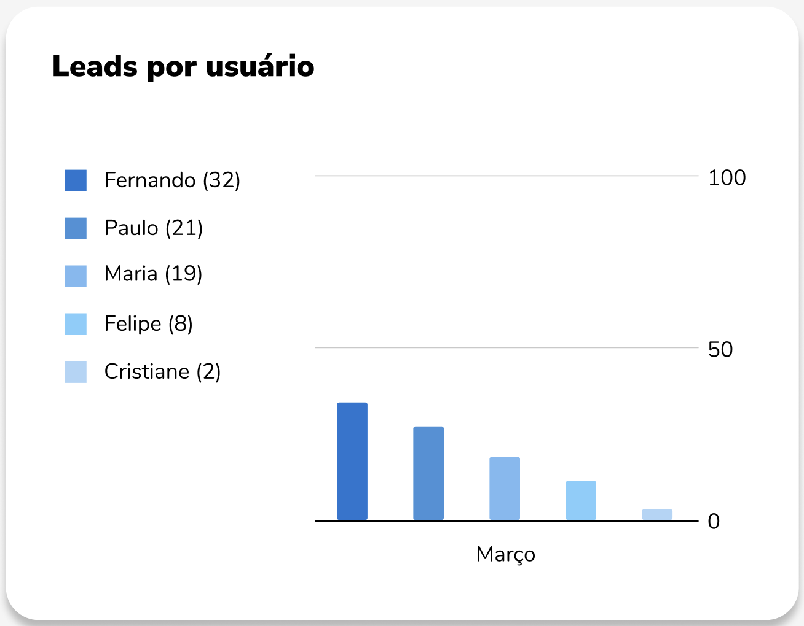 |

```json
{
  "leadsPorUsuario": {
    "mes": "Março",
    "usuarios": [
      {
        "nome": "Fernando",
        "quantidade": 32
      },
      {
        "nome": "Paulo",
        "quantidade": 21
      },
      {
        "nome": "Maria",
        "quantidade": 19
      },
      {
        "nome": "Felipe",
        "quantidade": 8
      },
      {
        "nome": "Cristiane",
        "quantidade": 2
      }
    ]
  }
}
```
<style>
img[alt="Gráfico de Leads por Usuário"] {
  max-width: 400px;
  height: auto;
}
</style>
---
# Card: Cadastro X Matrículas
| Visual do Gráfico |
|-------------------|
| 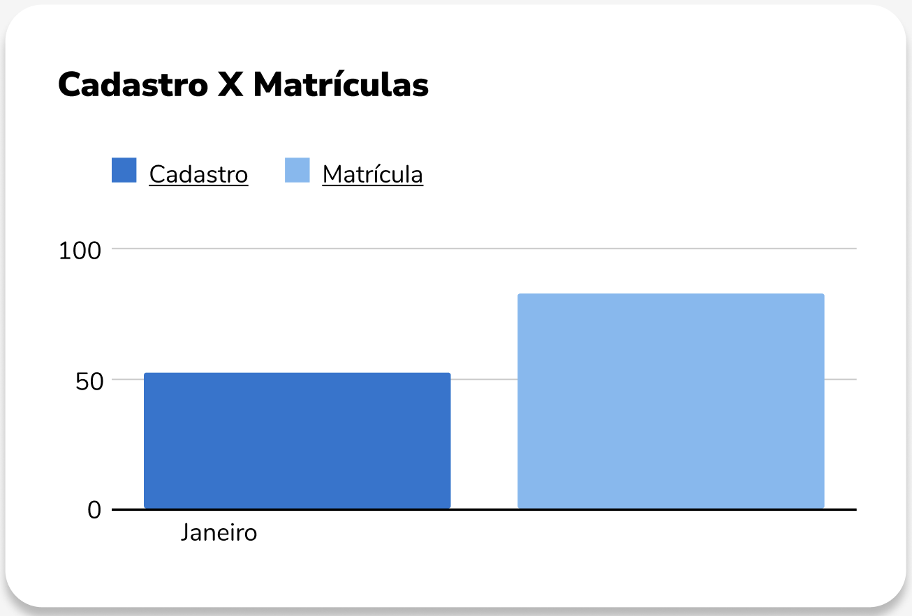 |

```json
{
  "cadastroVsMatricula": [
    {
      "mes": "Janeiro",
      "cadastro": 54,
      "matricula": 83
    }
  ]
}
```
<style>
img[alt="Gráfico de Cadastro X Matrículas"] {
  max-width: 400px;
  height: auto;
}
</style>
---
# Card: Aulas por instrutor (Agendadas)
| Visual do Gráfico |
|-------------------|
| 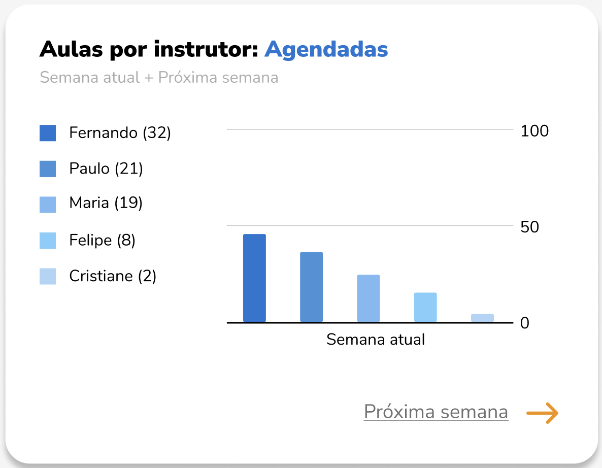 |

```json
{
  "aulasPorInstrutorAgendadas": {
    "periodo": "Semana atual",
    "instrutores": [
      {
        "nome": "Fernando",
        "quantidade": 32
      },
      {
        "nome": "Paulo",
        "quantidade": 21
      },
      {
        "nome": "Maria",
        "quantidade": 19
      },
      {
        "nome": "Felipe",
        "quantidade": 8
      },
      {
        "nome": "Cristiane",
        "quantidade": 2
      }
    ]
  }
}
```
<style>
img[alt="Gráfico de Aulas por Instrutor - Agendadas"] {
  max-width: 400px;
  height: auto;
}
</style>
---
# Card: Aulas por veículos (Agendadas)
| Visual do Gráfico |
|-------------------|
| 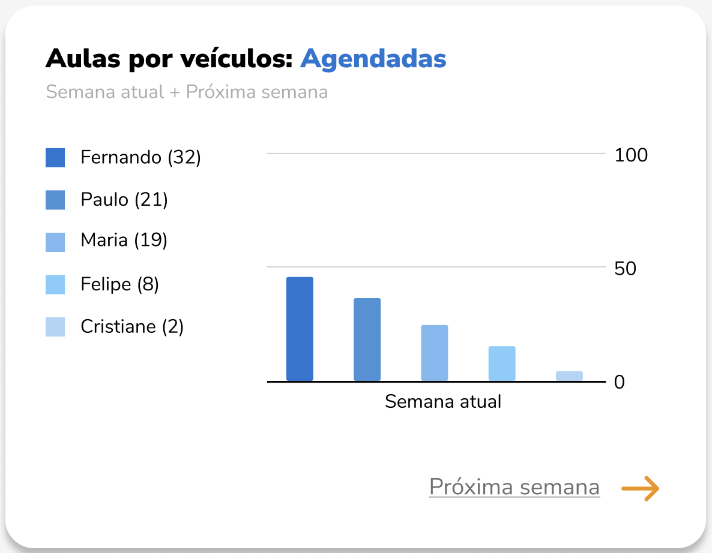 |

```json
{
  "aulasPorVeiculoAgendadas": {
    "periodo": "Semana atual",
    "veiculos": [
      {
        "nome": "Fernando",
        "quantidade": 32
      },
      {
        "nome": "Paulo",
        "quantidade": 21
      },
      {
        "nome": "Maria",
        "quantidade": 19
      },
      {
        "nome": "Felipe",
        "quantidade": 8
      },
      {
        "nome": "Cristiane",
        "quantidade": 2
      }
    ]
  }
}
```
<style>
img[alt="Gráfico de Aulas por Veículos - Agendadas"] {
  max-width: 400px;
  height: auto;
}
</style>
---
# Card: Aulas por instrutor (Realizadas)
| Visual do Gráfico |
|-------------------|
| 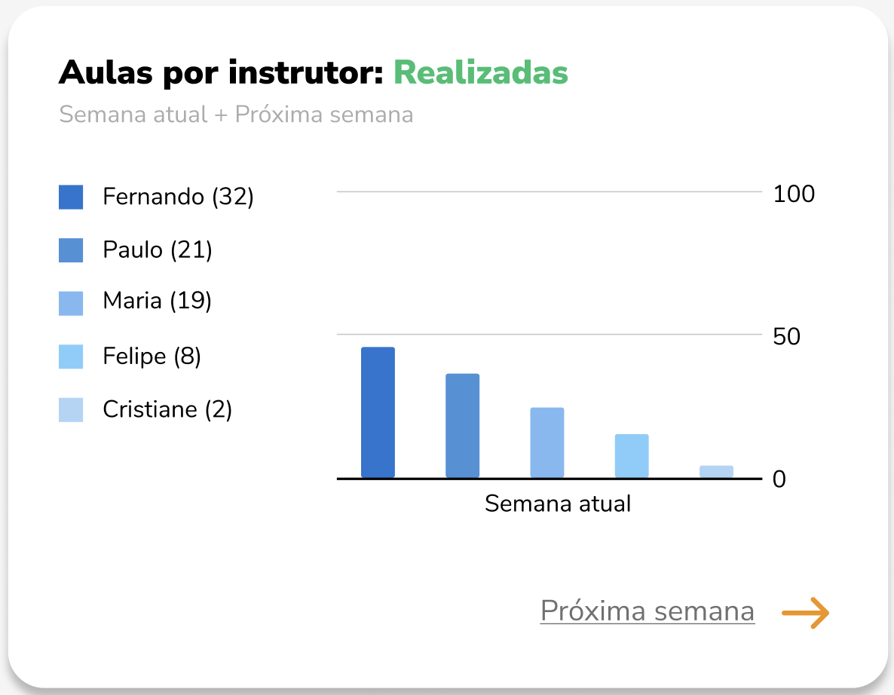 |

```json
{
  "aulasPorInstrutorRealizadas": {
    "periodo": "Semana atual",
    "instrutores": [
      {
        "nome": "Fernando",
        "quantidade": 32
      },
      {
        "nome": "Paulo",
        "quantidade": 21
      },
      {
        "nome": "Maria",
        "quantidade": 19
      },
      {
        "nome": "Felipe",
        "quantidade": 8
      },
      {
        "nome": "Cristiane",
        "quantidade": 2
      }
    ]
  }
}
```
<style>
img[alt="Gráfico de Aulas por Instrutor - Realizadas"] {
  max-width: 400px;
  height: auto;
}
</style>