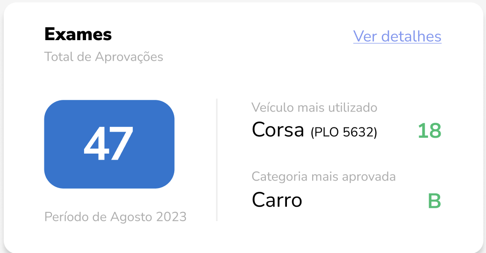

# Card: Financeiro
| Visual do Gráfico|
|-----------------------|
|  |

```json
{
  "financeiro": {
    "entradasConsolidadas": 123128.21,
    "saidasConsolidadas": 44208.37,
    "entradaPrevista": 83128.21,
    "saidaPrevista": 24208.37,
    "metaMes": {
      "mes": "Agosto",
      "percentualAlcancado": 68.7
    }
  }
}
```
---
# Card: Novos Alunos
| Visual do Gráfico|
|-----------------------|
|  |

```json
{
  "novosAlunos": {
    "total": 27,
    "periodo": "últimos 3 meses",
    "porUsuario": {
      "Leonardo": 13
    },
    "porOrigem": {
      "WhatsApp": 21
    }
  }
}
```

---
# Card: Leads
| Visual do Gráfico|
|-----------------------|
|  |

```json
{
  "leads": {
    "cadastros": 12,
    "matriculas": 8,
    "periodo": "últimos 3 meses",
    "porUsuario": {
      "Leonardo": 13
    },
    "porOrigem": {
      "WhatsApp": 21
    }
  }
}
```
---
# Card: Aulas práticas
| Visual do Gráfico |
|-------------------|
|  |

```json
{
  "aulasPraticas": {
    "total": 52,
    "periodo": "Agosto 2023",
    "escopo": "Semana atual + próxima semana",
    "menorNumeroAulas": {
      "nome": "Carlos Silva",
      "quantidade": 2
    },
    "maiorNumeroAulas": {
      "nome": "Anderson Pe...",
      "quantidade": 22
    }
  }
}
```

---
# Card: Exames
| Visual do Gráfico |
|-------------------|
|  |

```json
{
  "exames": {
    "totalAprovacoes": 47,
    "periodo": "Agosto 2023",
    "veiculoMaisUtilizado": {
      "nome": "Corsa",
      "placa": "PLO 5632",
      "quantidade": 18
    },
    "categoriaMaisAprovada": {
      "nome": "Carro",
      "categoria": "B"
    }
  }
}
```
